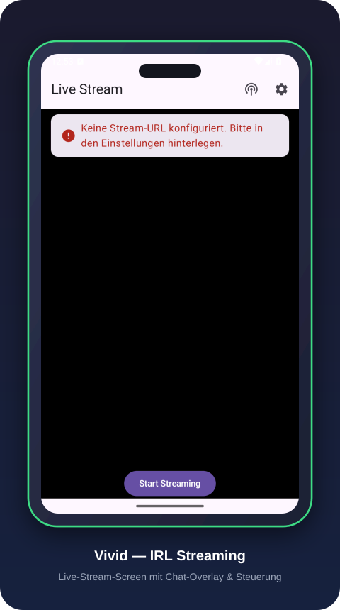
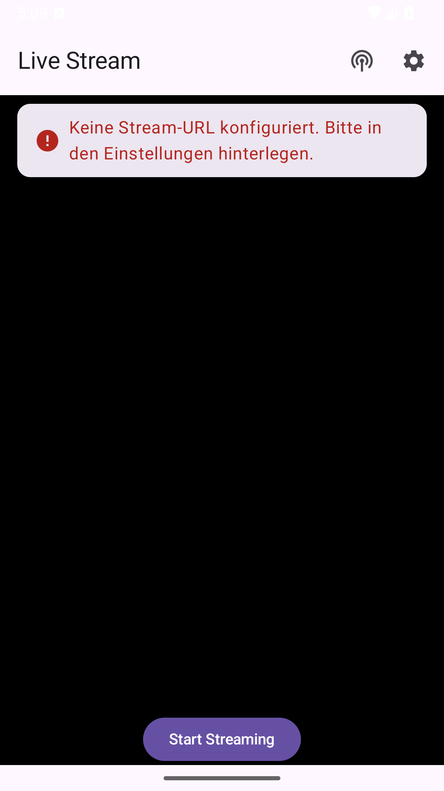
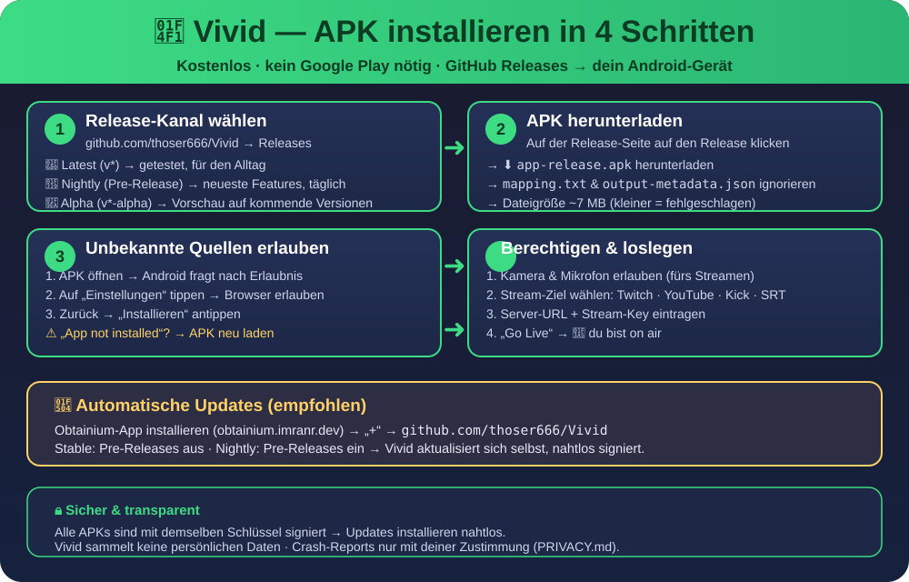
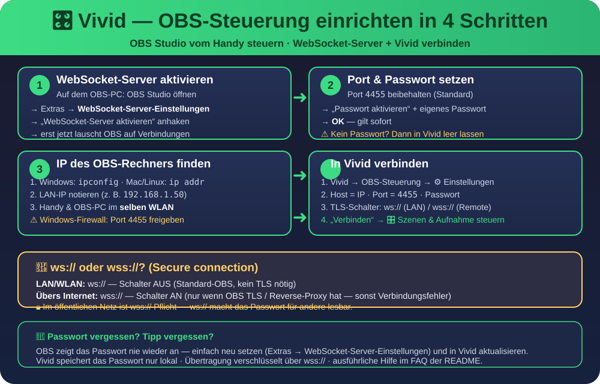

# 📱 Vivid
### Android version of the open-source Moblin IRL streaming app

<div align="center">


**Professional IRL streaming for Android — aiming for full feature parity with Moblin**

<p align="center">
  <a href="docs/hero.svg">
    
  </a>
</p>

[📲 Install](#-installation) • [📥 Download APK](../../releases) • [📖 User Guide](docs/user-guide.md) ([🇬🇧 EN](docs/user-guide.en.md)) • [🤖 AI Chat Bot](docs/ai-chat-bot.md) • [📝 Changelog](CHANGELOG.md) • [📚 Documentation](../../wiki) • [🐛 Report Bug](../../issues) • [💬 Discussions](../../discussions)

</div>

---

## 📸 Screenshots

<p align="center">
  
  
</p>

---

## 🎯 Goal: Feature Parity with Moblin

Vivid is an Android implementation of the open-source [Moblin](https://github.com/eerimoq/moblin) IRL streaming app. The **end goal** is to be **at least functionally equivalent to Moblin** — every feature Moblin offers should work in Vivid, adapted to the Android platform.

This README tracks that progress honestly: the [Features](#-features) section marks what is already implemented, what is in progress, and what is still planned. The [Parity Status](#-parity-status) table gives the per-feature status at a glance — the detailed work list lives in [PARITY.md](PARITY.md).

> ⚠️ **Note:** Features marked as *planned* are not shipped yet — don't rely on them for production streaming until they land.

---

## 📲 Installation

> Vivid is not on Google Play (yet) — APKs are published as **GitHub Releases**. Everything below is free and takes about 2 minutes.

<p align="center">
  <a href="docs/install-quickstart.svg">
    
  </a>
  <br>
  <em>📄 One-page quickstart: <a href="docs/install-quickstart.svg">Installations-Infografik (SVG)</a></em>
</p>

### Step 1: Pick your release channel

| Channel | What you get | Best for |
|---------|--------------|----------|
| 🚀 **Latest / Stable** (`v*` tags) | Tested releases with auto-generated release notes | Daily use |
| 🌙 **Nightly** (prerelease) | Fresh build of every new feature, updated daily | Testers, early adopters |
| 🧪 **Alpha** (`v*-alpha`) | First stage of versioned releases | Previewing upcoming features |

📄 The full versioning strategy (versionName/versionCode, stage criteria) is documented in [RELEASE.md](RELEASE.md). The complete release history (stable, alpha, nightly — automatically mirrored from GitHub Releases) lives in [CHANGELOG.md](CHANGELOG.md).

### Step 2: Download the APK

1. Open the [**Releases**](../../releases) page
2. Click **"Latest"** (stable), or expand the prerelease list for **nightly** / **alpha** builds
3. Download **`app-release.apk`** (ignore `mapping.txt` and `output-metadata.json` — those are for developers only)
4. If your browser warns about the file type, confirm "Download anyway"

### Step 3: Allow installation from unknown sources

Android blocks APKs from outside the Play Store by default. On first launch of the APK:

1. Open the downloaded file in your file manager or notification bar
2. Android shows a dialog like *"Install unknown apps"* → tap **Settings**
3. Allow your browser / file manager to install unknown apps
4. Go back and tap **Install**

> 🔒 **Signing:** All official APKs are signed with the same release key. If Android ever shows *"App not installed"*, you may have a corrupted download — delete the file and download it again.

### Step 4: Grant permissions & go live

After installation, Vivid asks for **camera** and **microphone** permissions when you tap **Go Live** (notifications are requested too on Android 13+ — they power the streaming status notification). Then follow the [Platform Setup Guides](#-platform-setup-guides) to connect Twitch, YouTube, Kick, or your own server.

> 🔋 **Background streaming:** While streaming, a persistent notification („Vivid sendet live“) with a **Stop** action keeps the stream alive when you leave the app or turn the screen off. The encoder runs **independent of the camera preview surface** (GL-free pipeline), so the stream also continues if you swipe Vivid away from the recents list or rotate the device — the preview simply reappears when you reopen the app. Tap the notification's Stop button (or the Stop button in the app) to end the stream.

> ✅ **Go-Live Self-Check:** Before starting, Vivid validates the configured URL and stream key on the streaming screen and shows clear messages (e.g. *"Keine Stream-URL konfiguriert"*, *"Nicht unterstütztes Protokoll"*, missing stream key). Blocking problems prevent the start; warnings are shown but don't block.

### 🔄 Automatic updates (Obtainium)

To keep Vivid up to date automatically, use [**Obtainium**](https://obtainium.imranr.dev/):

1. Install Obtainium from [obtainium.imranr.dev](https://obtainium.imranr.dev/) (or its own GitHub releases)
2. Tap **+** → enter `https://github.com/thoser666/Vivid` as the source
3. It auto-detects GitHub Releases — pick your channel:
   - **Stable only:** track the latest release (disable *"Include pre-releases"*)
   - **Nightly:** enable *"Include pre-releases"* to follow every feature build
4. Tap **Add** — Obtainium now checks for updates and installs them automatically

Because every APK is signed with the same key, updates (including nightly → stable and vice versa) install seamlessly over the previous version.

**🧪 Testing the update flow**

1. Install an **older nightly** APK from the [Releases](../../releases) page (e.g. the previous build)
2. Open **Settings** — the installed version is shown at the bottom, and an „⬆ Update verfügbar: …“ badge appears automatically if a newer build exists
3. Add the app in Obtainium as described above (**Include pre-releases** on for nightly)
4. (Optional) In **Settings → „Über Vivid & Updates“** tap **„Nach Updates suchen“** to see the latest GitHub release
5. In Obtainium tap **Update** — the newer APK installs over the old one (same signing key)
6. Reopen **Settings** — the version number has increased and the badge is gone ✅

The About-screen check follows the same rules as [RELEASE.md](RELEASE.md): it only suggests **newer** versions (nightly → nightly/alpha/beta/stable, never a downgrade).

---

## ✨ Features

### ✅ Implemented

- 🎛️ **OBS WebSocket Control** - Control OBS Studio directly from your phone (switch scenes, start/stop recording and streaming)
- 🌐 **Streaming Pipeline** - RootEncoder-based live streaming to your configured RTMP/SRT ingest (Twitch, YouTube, Kick, or your own server)
- 🔗 **Multi-Streaming** - Send the same stream to **two RTMP(S) targets in parallel** (primary + optional secondary): add a secondary URL/key in Settings → Stream („Multi-Streaming (optional)“) and both targets start on Go Live. Each target shows its own status on the streaming screen (bereit / verbinde… / sendet live / fehlgeschlagen), and if one target fails it stops on its own while the other keeps streaming — ideal for cross-streaming to Twitch and YouTube at the same time
- 🔒 **RTMPS (TLS)** - Encrypted ingest via `rtmps://` (verified against RootEncoder 2.7.5: native TLS handshake, port 443); enabled per-platform or via the TLS toggle, standard port 1935 is auto-normalized to 443
- ✅ **Go-Live Self-Check** - Before starting the stream, Vivid validates the configured URL and stream key (missing/invalid URL, unsupported protocol, missing key) and shows clear, actionable German messages directly on the streaming screen — blocking errors prevent starting, warnings (e.g. missing key) are shown but don't block
- 🔍 **Focus Lock** - Toggle autofocus ⇄ infinity lock on the streaming camera to prevent focus hunting (rain drops, dirt on the windshield) during drive/train streams — Moblin #377; works on the actual RootEncoder camera (not just the preview) and can be set before going live
- 👆 **Camera Controls on the Streaming Preview** - **Tap-to-focus** (single tap), **pinch to zoom** (clamped to the camera's zoom range) and **zoom reset** (double tap) directly on the live preview — gestures drive the real RootEncoder camera, not the preview only. Plus a **stabilization toggle** (optical stabilization preferred, EIS fallback) and a **torch/flashlight toggle** (RootEncoder lantern API, also available as `!torch` owner bot command) next to the focus-lock button
- 💬 **Twitch Chat Integration** - Full Twitch chat data layer via **EventSub (read) + Helix (send), no IRC** — `TwitchChatEventSubReader` (WebSocket `channel.chat.message`) + Helix `POST /helix/chat/messages`; on top of it the chat overlay, the AI chat bot and a full settings screen (see below). Formally ✅ with **Twitch scope** (Beta-Gate): **Kick/YouTube/SOOP + Twitch OAuth browser flow (sending & moderation) = post-beta roadmap**
- 💬 **Twitch Chat Overlay** - Show the chat of any Twitch channel over the live preview (read via Twitch EventSub, no IRC). Configure the channel and toggle the overlay in Settings → **Chat-Overlay**; the latest messages appear bottom-left with each user's Twitch color, **Twitch badges** (Broadcaster/Moderator/Subscriber, fetched via the Helix Chat-Badges API and rendered as CDN images before the username), **inline Twitch emotes** (rendered as CDN images via Coil) and **event alerts** (follows, subscriptions, gift subs, resubs and raids — shown as colored banner lines above the chat, auto-dismissed after a few seconds; the bot token needs `moderator:read:followers` for follows, i.e. the bot must be a moderator, and `channel:read:subscriptions` for subs/gifts/resubs). A test alert can be triggered locally via the `triggerTestAlert` API (or the owner command `!testalert follow|sub|gift|resub|raid`) to verify the overlay before going live. The connection auto-reconnects, and the overlay hides itself as soon as it is disabled in the settings
- 🤖 **AI Chat Bot** - A fully automated, in-app chat bot (inspired by cloud services like Stream Chat AI): it connects to your Twitch chat when you go live, answers viewers through an LLM of your choice (any OpenAI-compatible endpoint — OpenAI, Gemini, Groq, DeepSeek, or a local Ollama server) and shuts down cleanly when the stream ends. A **mode switch** in the settings picks between **„Bot (wie Moblin)“** (deterministic `!`-commands like `!help`/`!uptime`/`!tts`/`!bot`, no LLM needed) and **„KI autonom“** (the AI decides itself whether and how to reply, including staying silent). `!tts` toggles chat text-to-speech (reads chat messages aloud on the streamer's device, like Moblin's bot). Mentions-only mode, a reply cooldown and a per-minute rate limit keep it from spamming; configurable **limits** protect against spam and LLM cost: a per-viewer cooldown (default 60 s), a per-viewer reply cap per stream, and an hourly reply budget (0 = off for each) — platform-neutral via user id, moderators bypass the per-viewer limits; a **quick-start preset bar** (Locker/Balanced/Streng/Eigene, the last choice is persisted and restored on app start) fills the three limits in one tap, and a **live usage readout** (replies this hour vs. budget, per-stream total, top viewers) lets the streamer watch the cost budget in the settings screen. A **coexistence mode** lets it run side by side with another tool's bot (e.g. Rivulet): other bot logins can be ignored and a command scope (`@vividbot` mention or a custom prefix like `!v!help`) prevents double replies and double actions. An **owner mode (streamer only)** adds exclusive commands — `!start`/`!stop`/`!diag`/`!ask`/`!torch` — that can start/stop the stream, run a diagnostic with recommendations, query a separate, more powerful owner LLM, and toggle the flashlight, only the channel owner (broadcaster badge) and explicitly listed logins (e.g. a second account) can use them, viewers get a hint instead. Auto-connect/auto-shutdown is wired into the streaming foreground service — see [docs/ai-chat-bot.md](docs/ai-chat-bot.md)
- ⚙️ **Persisted Stream Settings** - Stream URL/key (incl. optional secondary target for multi-streaming) and OBS connection details are stored and reused across sessions
- 🔄 **In-App Update Check** - Settings shows the installed version + an „Update verfügbar“ badge; the About screen (Settings → „Über Vivid & Updates“) adds a manual check against GitHub Releases — ideal for verifying Obtainium updates. Results are cached for 1 hour (DataStore), so opening Settings does not hammer the GitHub API rate limit; the manual check in About always refreshes and shows the **release notes** of the newest build
- 🕹️ **Web Remote Control** - A small LAN server (port 8080, token-protected) exposes the streaming status via `http://<phone-ip>:8080/status` and allows starting/stopping the stream from any browser in the same network — see [Installation](#-installation)
- 🔋 **Background Streaming (Foreground Service)** - The stream keeps running when the app is in the background (home button, screen off) **and even if the Activity is destroyed** (recents swipe, rotation): a foreground service with a persistent notification (live status + stop action) and a partial wake lock keeps the encoder and camera alive, and the encoder runs on a view-independent GL pipeline (RootEncoder Context-constructor) so it never depends on the camera preview surface
- 🔓 **Open Source** - Completely free and open source
- 🌍 **I18n Support** — all UI strings externalized into per-module `strings.xml` (German default, full English `values-en` and full French `values-fr` — three complete languages), including validator/notification/update-check messages; CI gates enforce externalization and `values` ↔ `values-en` ↔ `values-fr` completeness ([docs/i18n-plan.md](docs/i18n-plan.md)). Bot/`!diag` texts are intentionally not localized (streamer language).

### 📋 Planned (Roadmap to Moblin parity)

- 📡 **Multi-Network Bonding (SRTLA)** - Combine WiFi and mobile data for rock-solid streams
- 💬 **Chat Extensions** - Emotes (BTTV/FFZ/7TV) plus chat polish: viewer count, set stream title/category, chat polls, and chat display details (hide/gray out deleted messages, replies, `/me` styling, cheered bits, adjustable overlay layout) — note: moderation (`!ban`/`!timeout`/`!delete`), chat-bot **media player control** via MediaSession (Apple Music, Spotify, etc.; adapted from Moblin 33.12.0) and the **AI chat bot** itself are already implemented (see above)
- 🎨 **Overlays & Widgets** - Follower/donation alerts, custom graphics and branding; text widgets incl. weather, timer/stopwatch, distance, G-force and road/route variables (altitude, GPS and speed are already implemented — see above); further widget types planned: image widget, QR-code widget, battery indicator (with low-battery chat warning), grid overlay for positioning, and speech-to-text subtitles
- 📹 **High-Quality Streaming** - Up to 4K resolution at 60fps with H.264/AVC and H.265/HEVC
- 🔒 **Extended Protocols** - SRTLA, RIST, and WHIP (WebRTC) — RTMPS is already implemented (see below); RTMP-Pull/ingest server mode (community request #407); adaptive bitrate for SRT(LA) + per-connection upload statistics
- 🎬 **Scenes & Video Sources** - Save and switch complete stream configurations (basic scenes) incl. an auto scene switcher; screen capture and a basic video player as additional stream sources (multi-cam)
- 🎛️ **Pro Camera Controls** - Manual exposure bias, white balance, ISO and focus; back-camera lens selection (ultra-wide/wide/tele); torch and low-light boost
- 📼 **Replays** - Record to disk (MP4) while streaming and save/play replays
- 🖥️ **Externes Display / Streamer-Browser** - Video on an external display (Android Cast / Presentation) and a built-in browser visible only to the streamer (Moblin feature)
- 📱 **Landscape & Portrait** - Landscape in both orientations (video always gravity-down) and a portrait UI with landscape video (Vivid is currently portrait-only)
- ❤️ **BLE Fitness Sensors** - Heart-rate belt and cycling power monitor (BLE) shown in the text widget — related to the Oura-ring cloud row
- 🕹️ **Remote & Companion Features** - Web remote control (incl. talkback mic selection, mic/bitrate/zoom control, logs), game controller support, deep linking
- 📸 **Photo Shoot Quick Button** - Periodically capture high-resolution clean pictures to the gallery; manual snapshots with optional Discord auto-upload (new in Moblin 33.12.0)

## 🛣️ Roadmap

**Current stage: Beta** — the [Beta-Gate is formally reached](RELEASE.md) (17/17 Moblin parity ✅, Twitch chat ✅ with scope, ≥1 widget ✅); the first beta `v0.5.1-beta` shipped (current: `v0.5.5-beta`). Open checklists for the current stage:

- 🧪 **[Beta-Build-Checkliste](RELEASE.md#-erster-beta-build-plan)** — Beta-Gate-Bedingungen + Play-Unterlagen + ≥2 manuelle Tester (abhakbare Liste in RELEASE.md)
- ✅ **[Play-Vorbereitung P0–P2](RELEASE.md#-play-vorbereitung-priorisierte-abhakliste-mit-zeitaufwand)** — Master-Checkliste für den ersten Play-Upload (Secrets, Console, Screenshots, Tester; ~4–5 h einmalig; Fortschritt live in [Issue #116](https://github.com/thoser666/Vivid/issues/116))

**Post-Beta roadmap buckets** (full detail + open tasks in [PARITY.md](PARITY.md)):

- 💬 **[Multi-Plattform-Chat (Kick, YouTube, SOOP)](PARITY.md#-roadmap-bucket-multi-plattform-chat-kick-youtube-soop)** — platform adapters (YouTube innertube with anonymous reading, Kick Pusher WebSocket + GraphQL, SOOP) + OAuth login (PKCE), parallel sessions for multi-streaming
- 🎨 **[Color-Spaces + 3D-LUTs](PARITY.md#-roadmap-bucket-color-spaces--3d-luts)** — sRGB/P3/Log video color spaces + PNG 3D-LUTs (Hald CLUT) in the stream pipeline
- 📋 **Remaining Moblin-parity features** (SRTLA bonding, H.264/H.265 up to 4K/60fps, RIST/WHIP, RTMP ingest, emotes, more widgets, …) — see the [Planned features](#-planned-roadmap-to-moblin-parity) list and the per-feature [Parity Status](#-parity-status) table
- 🆕 **Moblin-Gap-Analyse (21.08.)** — systematic comparison against the Moblin README surfaced **20 missing features**, now tracked in [PARITY.md](PARITY.md): scenes & video sources, pro camera controls (exposure/WB/ISO/lens), replays/record-to-disk, image/QR/battery/grid widgets, speech-to-text subtitles, landscape/portrait, viewer count, title/category, chat display details, chat polls, streamer browser, adaptive bitrate, BLE sensors — applicable Moblin features: **62**

Release stages & criteria (nightly → alpha → beta → stable) and the versioning strategy: **[RELEASE.md](RELEASE.md)**.

## 📋 Platform Setup Guides

<details>
<summary><strong>🟣 Twitch Setup</strong></summary>

1. Go to [Twitch Creator Dashboard](https://dashboard.twitch.tv/)
2. Navigate to **Settings** → **Stream**
3. Copy your **Stream Key**
4. In Vivid:
   - Server: `rtmp://live.twitch.tv/live/`
   - Stream Key: *[paste your key]*

</details>

<details>
<summary><strong>🔴 YouTube Setup</strong></summary>

1. Open [YouTube Studio](https://studio.youtube.com/)
2. Click **"Go Live"** → **"Stream"**
3. Copy the **Stream URL** and **Stream Key**
4. In Vivid:
   - Server: *[paste stream URL]*
   - Stream Key: *[paste stream key]*

</details>

<details>
<summary><strong>🟢 Kick Setup</strong></summary>

1. Go to [Kick Creator Dashboard](https://kick.com/dashboard)
2. Navigate to **Settings** → **Stream Settings**
3. Copy your **Stream Key**
4. In Vivid:
   - Server: `rtmp://ingest.kick.com/live/`
   - Stream Key: *[paste your key]*

</details>

<details>
<summary><strong>⚙️ Owncast / Custom Platform (freie RTMP-URL)</strong></summary>

Vivid streams **protocol-based** (RTMP / RTMPS / SRT) — you are *not* limited to Twitch, YouTube or Kick. Any platform with a standard ingest works via the free **Stream URL** field; the platform templates (Twitch/YouTube/Kick) are only convenience presets. Example: [Owncast](https://owncast.online) (open-source, self-hosted):

1. **Install Owncast** (e.g. Docker: `docker run -p 8080:8080 -p 1935:1935 ghcr.io/owncast/owncast:latest`) and open the web UI
2. **Get the ingest data:** Owncast shows its **RTMP ingest** (`rtmp://<your-server>/live`) and **Stream Key** in the admin/stream page
3. In Vivid → **Settings → Streaming & OBS**: tap **„Benutzerdefiniert“** (Custom) to clear the URL, then enter those values as **Stream URL** + **Stream Key** — the field accepts any RTMP(S)/SRT URL; the TLS toggle stays as you left it
4. **Go Live** — the stream goes directly to your server

> ⚠️ **Chat:** Vivid's chat (overlay + AI bot) currently connects **only to Twitch** — Owncast chat is *not* read yet. Streaming to Owncast works fully; chat integration for custom platforms is on the post-beta roadmap.

</details>

<details>
<summary><strong>🎛️ OBS Studio Setup (WebSocket-Steuerung)</strong></summary>

<p align="center">
  <a href="docs/obs-setup-quickstart.svg">
    
  </a>
  <br>
  <em>📄 One-page quickstart: <a href="docs/obs-setup-quickstart.svg">OBS-Setup-Infografik (SVG)</a></em>
</p>

1. **In OBS aktivieren:** Extras → **WebSocket-Server-Einstellungen** → *„WebSocket-Server aktivieren“* anhaken
2. **Port & Passwort:** Standard-Port `4455` behalten, optional ein **Passwort** setzen (wenn keins gesetzt ist, das Feld in Vivid leer lassen)
3. **IP ermitteln:** LAN-IP des OBS-Rechners (Windows: `ipconfig`, Mac/Linux: `ip addr`) — Handy und PC müssen im **selben WLAN** sein
4. **In Vivid verbinden:** OBS-Steuerung → ⚙️ Einstellungen → Host = IP, Port = `4455`, Passwort + *„Secure connection (wss://)“* passend zum Setup (LAN = ws://, Remote = wss://)

> 🧪 Probleme beim Verbinden? Siehe die [OBS-FAQ-Einträge](#-faq--häufige-probleme) (Verbindung schlägt fehl, Passwort, ws:// vs. wss://).

</details>

<details>
<summary><strong>📡 SRT Server Setup</strong></summary>

1. Set up your SRT server or use a service provider
2. Get your server IP, port, and stream ID
3. In Vivid:
   - Protocol: **SRT**
   - Server: `srt://[server-ip]:[port]`
   - Stream ID: *[your stream ID]*
   - Configure latency and encryption as needed

</details>

<details>
<summary><strong>🕹️ Web Remote Control (Stream per Browser steuern)</strong></summary>

Vivid startet einen kleinen **LAN-Server** (Port **8080**), über den du den Stream-Status abfragen und den Stream starten/stoppen kannst — praktisch, wenn das Handy als Kamera läuft und du vom Laptop steuern willst:

1. **Handy und Laptop ins selbe WLAN** bringen
2. **Token holen:** In Vivid unter **Einstellungen → Web-Remote-Control** steht dein **Remote-Token** (wird einmalig erzeugt und gespeichert)
3. **IP ermitteln:** LAN-IP des Handys (Android: **Einstellungen → WLAN → Verbundenes Netz → Details**)
4. **Status abfragen (ohne Token):**

   ```bash
   curl http://<handy-ip>:8080/status
   # → {"status":"IDLE"} | {"status":"STREAMING"} | ...
   ```

5. **Stream starten/stoppen (mit Token):**

   ```bash
   curl -X POST http://<handy-ip>:8080/start -H "Authorization: Bearer <dein-token>"
   curl -X POST http://<handy-ip>:8080/stop  -H "Authorization: Bearer <dein-token>"
   ```

> 🔒 Der Server läuft nur, solange die App geöffnet ist, und Aktionen benötigen das Token — im selben WLAN ist die Verbindung unverschlüsselt (wie bei OBS ws://), außerhalb des LAN nicht erreichbar.

> ℹ️ **Android 17 (API 37):** Seit `targetSdk 37` verlangt Android die **„Zugriff auf lokale Netzwerke“-Berechtigung** (`ACCESS_LOCAL_NETWORK`) für LAN-Server. Falls `/status` nicht erreichbar ist, in Vivid unter **Einstellungen → Web-Remote-Control** auf **„LAN-Zugriff für Remote-Control erlauben“** tippen (der Server startet danach automatisch neu).

</details>

---

## ❓ FAQ — Häufige Probleme

<details>
<summary><strong>🔧 „App not installed“ beim Installieren</strong></summary>

Meistens ist der Download beschädigt oder unvollständig:

1. Lösche die heruntergeladene `app-release.apk` aus deinem Download-Ordner
2. Lade sie **neu** von der [Releases-Seite](../../releases) herunter
3. Prüfe, dass die Datei **~7 MB** groß ist (eine deutlich kleinere Datei ist ein fehlgeschlagener Download)
4. Versuche es erneut — wenn der Fehler bleibt, installiere über Obtainium (unten), das die Datei verifiziert herunterlädt

> Falls du Vivid von einer **älteren Version** aktualisierst und der Fehler weiterhin auftritt: Deinstalliere zuerst die alte Version (Achtung: Stream-Einstellungen gehen dabei verloren) und installiere dann neu.

</details>

<details>
<summary><strong>📥 „Unbekannte Quelle nicht erlaubt“ / Installations-Button ist grau</strong></summary>

Android blockiert APKs außerhalb des Play Stores standardmäßig:

1. Beim ersten Installationsversuch erscheint ein Hinweis → tippe auf **Einstellungen**
2. Erlaube dem verwendeten Browser / Dateimanager, **unbekannte Apps zu installieren**
3. Gehe zurück und tippe erneut auf **Installieren**
4. Falls kein Hinweis erscheint: **Einstellungen → Apps → [Browser/Dateimanager] → Unbekannte Apps installieren** → erlauben

</details>

<details>
<summary><strong>🎥 „Kein Bild“ / Kamera bleibt schwarz beim Streaming</strong></summary>

1. Prüfe die **Kamera-Berechtigung**: Einstellungen → Apps → Vivid → Berechtigungen → Kamera = **Erlauben** (nicht „Nur während der Nutzung“ kann bei Hintergrund-Streaming Probleme machen)
2. Teste die Kamera in einer anderen App (z. B. der Standard-Kamera-App) — wenn sie dort auch schwarz ist, liegt es am Gerät
3. Falls du mehrere Kameras hast: Wähle in Vivid die **richtige Kamera** (Front-/Rückkamera) aus
4. Starte den Stream neu (Stop → Go Live)

> ⚠️ Android schließt die Kamera, wenn eine andere App sie belegt (z. B. eine offene Kamera-App oder ein Video-Call). Schließe solche Apps vor dem Streamen.

</details>

<details>
<summary><strong>📶 Verbindungsabbrüche / Stream bricht regelmäßig ab</strong></summary>

1. **Signal prüfen:** Mobiles Internet + WiFi — wechsle notfalls den Netzwerktyp und teste erneut
2. **Ingest-Server wechseln:** Wähle in Vivid einen anderen RTMP/SRT-Server deiner Plattform (z. B. einen näher gelegenen)
3. **Stream-Key prüfen:** Ein falscher oder abgelaufener Stream-Key führt zum Abbruch nach wenigen Sekunden — neu kopieren (auf Twitch wird der Key bei jedem Zurücksetzen ungültig)
4. **OBS-Steuerung deaktivieren:** Wenn du OBS nicht benutzt, entferne die OBS-Verbindungsdaten in den Einstellungen — eine fehlgeschlagene OBS-Verbindung kann den Stream-Start blockieren
5. **Latenz erhöhen:** Bei SRT kann eine höhere Latenz (200–500 ms) instabile Verbindungen glätten

> 📡 **Tipp für unterwegs:** Ein stabilerer Upload als der nötige ist wichtiger als die maximale Auflösung — senke Qualität/Auflösung bei schwachem Signal, statt den Stream abreißen zu lassen.

</details>

<details>
<summary><strong>🔑 Stream startet, aber Plattform zeigt „Kein Signal“ / Fehler im Dashboard</strong></summary>

1. Prüfe, ob **Server-URL und Stream-Key** in Vivid exakt den Werten aus dem Plattform-Dashboard entsprechen (kein Leerzeichen, keine zusätzlichen Zeichen)
2. Vergleiche mit den [Platform Setup Guides](#-platform-setup-guides) oben
3. Twitch: Der Server ist `rtmp://live.twitch.tv/live/` — den **Key** nie mit dem Server verwechseln
4. Teste den Key zuerst im Plattform-Dashboard („Test stream“), bevor du Vivid startest

</details>

<details>
<summary><strong>🎛️ OBS-Steuerung: Verbindung schlägt fehl</strong></summary>

Vivid kann OBS Studio nur steuern, wenn der **WebSocket-Server in OBS aktiv** und Vivid im selben Netzwerk erreichbar ist:

1. **WebSocket-Server aktivieren:** In OBS unter **Extras → WebSocket-Server-Einstellungen** → Haken bei *„WebSocket-Server aktivieren“* setzen. Erst dann lauscht OBS auf Verbindungen.
2. **Host prüfen:** In Vivid die **IP-Adresse des OBS-Rechners** eintragen (z. B. `192.168.1.50`) — `localhost` funktioniert nur, wenn OBS auf demselben Gerät läuft. IP unter Windows mit `ipconfig`, unter macOS/Linux mit `ip addr` herausfinden.
3. **Port prüfen:** Standard ist **4455** — in OBS (WebSocket-Server-Einstellungen) nachsehen, ob ein anderer Port konfiguriert ist, und denselben in Vivid eintragen.
4. **Gleiches Netzwerk:** Handy und OBS-Rechner müssen im **selben WLAN/LAN** sein (bzw. über VPN verbunden) — prüfe, ob z. B. das Handy im Mobilfunknetz hängt.
5. **Firewall:** Die Windows-Firewall muss eingehende Verbindungen auf Port 4455 erlauben (der OBS-Installer legt meist eine Regel an — nach Updates prüfen).
6. **Passwort & TLS:** Stimmen Passwort und die Option *„Secure connection (wss://)“* mit den OBS-Einstellungen überein? Siehe die nächsten beiden FAQ-Einträge.

> 🧪 **Schnelltest:** Öffne im Browser auf dem Handy `ws://<OBS-IP>:4455` — erscheint eine Meldung, dass die Verbindung hergestellt wurde (auch wenn sie danach geschlossen wird), ist OBS erreichbar und das Problem liegt an Passwort/TLS.

</details>

<details>
<summary><strong>🔑 OBS: Passwort vergessen / „Authentifizierung fehlgeschlagen“</strong></summary>

OBS zeigt das WebSocket-Passwort **nie wieder an** — du kannst es nur neu setzen:

1. In OBS: **Extras → WebSocket-Server-Einstellungen** öffnen
2. Haken bei **„Passwort aktivieren“** setzen (falls noch nicht geschehen) und ein **neues Passwort** eingeben
3. **OK** klicken — das neue Passwort gilt sofort
4. In Vivid unter **OBS-Einstellungen** das neue Passwort eintragen und erneut verbinden

> ⚠️ **Kein Passwort in OBS gesetzt?** Dann lasse das Passwort-Feld in Vivid **leer** — ein eingegebenes, falsches Passwort führt zum Abbruch der Verbindung. Umgekehrt: Verlangt OBS ein Passwort und Vivid hat keins, bricht die Verbindung ebenfalls ab (Vivid bricht die Verbindung bewusst ab, statt unauthentifiziert weiterzumachen).

**Tipp gegen vergessene Passwörter:** Verwende einen Passwort-Manager oder ein einheitliches LAN-Passwort — OBS selbst bietet keine „Passwort anzeigen“-Funktion.

</details>

<details>
<summary><strong>🔐 OBS: ws:// oder wss://? (Secure connection)</strong></summary>

Die Option **„Secure connection (wss://)“** in den OBS-Einstellungen von Vivid muss zum OBS-Setup passen:

| Verbindung | Wann verwenden | OBS-Voraussetzung |
|------------|----------------|-------------------|
| **ws://** (Standard, Schalter aus) | OBS im **eigenen LAN/WLAN** | Keine — OBS liefert standardmäßig Klartext-WebSockets auf Port 4455 |
| **wss://** (Schalter an) | OBS **remote über das Internet** | OBS muss TLS konfiguriert haben (Zertifikat) oder ein TLS-Reverse-Proxy (z. B. Caddy/nginx) davor laufen |

1. **Standard-OBS-Setup im LAN = ws://** — also den Schalter **aus** lassen
2. Für Remote-Zugriff (z. B. von unterwegs über Port-Forwarding/VPN) **wss://** aktivieren — **nur** wenn OBS tatsächlich TLS anbietet, sonst schlägt die Verbindung fehl
3. Zeigt OBS im Log „WebSocket server started on ws://…“ bzw. „wss://…“, siehst du direkt, welches Protokoll aktiv ist

> 🔒 **Sicherheit:** Über öffentliches Internet wird **immer wss://** empfohlen — unverschlüsseltes ws:// macht das OBS-Passwort (und damit die Steuerung) für jeden im Netz lesbar. Im heimischen WLAN ist ws:// vertretbar.

</details>

<details>
<summary><strong>🔇 Kein Ton beim Streaming (Audio fehlt)</strong></summary>

Bild läuft, aber Zuschauer hören nichts? Das sind die häufigsten Ursachen:

1. **Mikrofon-Berechtigung prüfen:** Einstellungen → Apps → Vivid → Berechtigungen → **Mikrofon = Erlauben** — ohne sie startet der Audio-Encoder nicht (Vivid zeigt „Failed to prepare audio/video“)
2. **Mikrofon ist belegt:** Android gibt das Mikrofon nur an **eine** App gleichzeitig — schließe andere Apps, die es nutzen (Anrufe, Sprachassistent, andere Streaming-/Aufnahme-Apps), und starte den Stream neu
3. **Bluetooth trennen:** Ist ein BT-Headset/Headset verbunden, nutzt Android dessen Mikrofon — für IRL-Streaming das Bluetooth-Gerät trennen oder in den Bluetooth-Einstellungen aufs Handy-Mikrofon umstellen
4. **Lautstärke:** Prüfe die **Media-Lautstärke** (nicht nur Klingelton) — bei 0 ist auch das Streaming stumm
5. **Neu starten:** Nach Berechtigungs-/Bluetooth-Änderungen hilft ein kompletter App-Neustart (Stream stoppen → App beenden → neu starten)

> 🎧 **Plattformseitig:** Auch im Plattform-Dashboard prüfen, ob der Audiopegel ankommt (z. B. Twitch Stream Manager) — so unterscheidest du ein Handy- von einem Plattform-Problem.

</details>

<details>
<summary><strong>🔄 Updates kommen nicht an (Obtainium)</strong></summary>

1. Prüfe, ob du in Obtainium **Pre-Releases** aktiviert hast (für Nightly-Builds) — Stable-Nutzer bekommen nur `v*`-Releases
2. Tippe in Obtainium auf „Aktualisieren“ (manueller Check), um den letzten Stand abzurufen
3. Alle offiziellen APKs sind mit demselben Schlüssel signiert — ein Update sollte immer installierbar sein; falls „App not installed“ erscheint, siehe FAQ oben

</details>

<details>
<summary><strong>❓ Obtainium zeigt eine falsche „Neueste Version“ (z. B. ein altes v0.2.x)</strong></summary>

**Symptom:** Obtainium meldet „Installierte Version ist 0.5.3-beta“, aber „Neueste Version ist v0.2.5“ (oder eine andere Version, die es in Vivid nie gab).

**Ursache:** Vivid veröffentlicht ausschließlich unter `vX.Y.Z-alpha`/`-beta` (aktuell `v0.5.4-beta`), Nightly-Builds als Pre-Release. Eine „v0.2.5“ existiert weder als Release noch als Tag. Die Anzeige stammt dann aus einem **veralteten Cache** des Obtainium-Eintrags oder der Eintrag zeigt auf eine **falsche/alte Quelle**.

**Lösung:**

1. In Obtainium den Vivid-Eintrag öffnen → **⋮-Menü → „App-Daten aktualisieren“** (Refresh), danach „Aktualisieren“ tippen
2. Bleibt die Anzeige falsch: **Eintrag löschen** und neu hinzufügen mit exakt `https://github.com/thoser666/Vivid`
3. **Pre-Releases-Toggle:** Für Beta/Alpha **nicht** nötig — diese Releases sind auf GitHub als normale Releases markiert (kein Pre-Release-Flag). Nur für **Nightly-Builds** den Toggle aktivieren
4. **Gegenprobe in der App:** Settings → „Über Vivid & Updates“ → „Nach Updates suchen“ zeigt die echte neueste GitHub-Version — weicht Obtainium davon ab, liegt es am Eintrag, nicht an Vivid

</details>

---

## 🧱 Tech Stack

| Area | Technology | Version |
|------|-----------|---------|
| Language | Kotlin | 2.2.20 |
| Build | Android Gradle Plugin | 9.3.1 |
| SDK | minSdk / compile+target | 24 / 37 |
| UI | Jetpack Compose (BOM) | 2025.09.00 |
| DI | Hilt + KSP | 2.59.2 / 2.3.11 |
| Networking | OkHttp / Ktor | 5.3.2 / 3.5.2 |
| Image Loading | Coil | 2.7.0 |
| Camera | RootEncoder (Stream-Pipeline + Vorschau) | 2.7.5 |
| Media | Media3 (ExoPlayer) | 1.9.0 |
| Serialization | kotlinx.serialization | 1.11.0 |
| Code Analysis | Sentry Gradle Plugin | 6.6.0 |

All versions are centrally defined in [`gradle/libs.versions.toml`](gradle/libs.versions.toml).

## 📊 Parity Status

Status: ✅ implemented · 🚧 in progress · 📋 planned

> 📋 Full per-feature tracking (responsible module + open tasks) lives in [PARITY.md](PARITY.md).

| Moblin Feature | Vivid | Notes |
|----------------|-------|-------|
| OBS WebSocket Control | ✅ | Scenes, recording, stream start/stop |
| OBS Config via QR Code | ✅ | Import `obsws://` / `obswebsocket` connect info (host, port, password) from the OBS QR code |
| Streaming (RTMP / SRT) | ✅ | Configurable URL/key via settings |
| RTMPS (TLS ingest) | ✅ | `rtmps://` via RootEncoder 2.7.5, port 443, TLS verified |
| Background Streaming (Foreground Service) | ✅ | Stream continues in background: notification + wake lock, stop action |
| Go-Live Self-Check | ✅ | Validates URL/key before starting, clear error messages |
| Focus Lock (∞) | ✅ | Autofocus ⇄ infinity lock toggle on the streaming camera (Moblin #377) |
| Persisted Stream Settings | ✅ | Stream & OBS config across sessions |
| I18n Support | ✅ | All UI strings externalized (per-module `strings.xml`, German default + full English `values-en` + full French `values-fr`); CI gates: externalization + `values`↔`values-en`↔`values-fr` completeness + hint-content guard — [docs/i18n-plan.md](docs/i18n-plan.md) |
| H.264/H.265, up to 4K/60fps | 📋 | Pipeline in place, quality targets planned |
| Multi-Network Bonding (SRTLA) | 📋 | SRTLA algorithm to be ported |
| Chat (Twitch) + Emotes + Moderation | ✅ Twitch-Scope | `feature-chat` — Twitch EventSub reader (`channel.chat.message`) + Helix send (`POST /helix/chat/messages`) + chat overlay over the live preview + **inline Twitch emotes** (CDN rendering via Coil) + **moderation done** (`!ban`/`!timeout`/`!delete`) + AI chat bot done (IRC removed); **Kick/YouTube/SOOP + OAuth (sending/moderation) = post-beta roadmap**, third-party emotes (BTTV/FFZ/7TV) pending |
| AI Chat Bot (Vivid extra) | ✅ | Fully automatic LLM chat bot: auto-connect on go-live, clean shutdown on stream end; OpenAI-compatible LLM providers; **owner mode** (`!start`/`!stop`/`!diag`/`!ask`, streamer-only via broadcaster badge + allow-list, separate owner LLM) |
| UI Color Schemes (Vivid extra) | ✅ | Material-3 palette (seed `#3DDC84`) replaces the template colors; **appearance settings category „Darstellung“**: user toggle System/Light/Dark/AMOLED (pure-black surfaces for OLED) + 6 curated accent colors (M3 TonalSpot palettes, Vivid Green stays the default) — applies live, no restart |
| Chat-Bot Media Player Control | ✅ | Generic media control via MediaSession (Apple Music, Spotify, …); Android adaptation of Moblin 33.12.0 — commands `!song`/`!next`/`!pause`/`!play`/`!prev` (needs notification access) |
| Overlays & Widgets | 🚧 | `feature-widgets`: **text/info widget** (time, GPS coordinates, speed, altitude) live as overlay — time/date ticker, `LocationProvider` (LocationManager), settings toggles, permission flow; weather/road variables + image/QR/battery/grid widgets + speech-to-text subtitles planned (Twitch chat overlay + event alerts already implemented in `feature-chat`) |
| Audio Tools (levels, muting, talk-back) | 📋 | |
| Extended Protocols (RIST, WHIP) | 📋 | |
| RTMP-Pull / Ingest (Server mode) | 📋 | Community request #407; Moblin offers ingests (RTMP, SRT(LA), RIST, RTSP, WHIP) |
| Web Remote Control | ✅ | LAN server (port 8080) with token auth: status, start/stop |
| Photo Shoot Quick Button | 📋 | Periodic high-res photos to the gallery; new in Moblin 33.12.0 |
| Game Controller Support | 📋 | |
| Deep Linking (`moblin://`) | 📋 | |
| Scenes (basic) + Auto Scene Switcher | 📋 | Complete stream configs as switchable scenes; video-source widget (multi-cam) |
| Pro Camera Controls + Lens Selection | 📋 | Manual exposure bias, white balance, ISO, focus; ultra-wide/wide/tele selection |
| Screen Capture + Video Player as source | 📋 | MediaProjection + basic video player as stream source |
| Record to Disk (MP4) + Replays | 📋 | Record while streaming; save & play replays |
| Torch / Low-Light Boost | ✅ | Flashlight toggle via RootEncoder lantern API + `!torch` bot command |
| External Display (Cast / HDMI-out) | 📋 | Video on an external display via Android Cast/Presentation |
| VTuber / PNGTuber | 📋 | Basic avatar instead of the camera |
| Image / QR / Battery / Grid Widgets | 📋 | Image + QR code on stream, battery indicator (+ low-battery chat warning), grid overlay for positioning |
| Speech-to-Text Subtitles | 📋 | Live subtitles from the mic as overlay |
| Twitch: Viewer Count, Title/Category, Ads | 📋 | Helix streams/channels API |
| Chat Display Details (deleted msgs, replies, /me, bits) | 📋 | Hide/gray out deleted messages, show replies, `/me` styling, cheered bits, adjustable layout |
| Chat Poll | 📋 | Simple chat polls via the bot |
| Adaptive Bitrate (SRT/SRTLA) + Upload Stats | 📋 | Dynamic bitrate + per-connection statistics |
| Streamer Browser | 📋 | Built-in browser, visible to the streamer only |
| Landscape / Portrait | 📋 | Landscape 0/180 (gravity-down video) + portrait UI with landscape video |
| BLE Fitness Sensors (HR, Cycling Power) | 📋 | Heart-rate belt + cycling power monitor (related to the Oura-ring row) |

---

## 🛠️ Development

### Project Structure

| Module | Purpose |
|--------|---------|
| `app` | Application entry point, navigation, DI wiring |
| `core` | Shared utilities and base classes |
| `domain` | Business logic, models, use cases |
| `data` | Repositories and data sources |
| `feature-streaming` | Streaming pipeline (RootEncoder, encoding) |
| `feature-chat` | Live chat integration |
| `feature-settings` | App settings |
| `feature-widgets` | Stream overlays and widgets |
| `feature-obs-control` | OBS Studio WebSocket control |

### Building from Source

```bash
# Clone the repository
git clone https://github.com/thoser666/Vivid.git
cd Vivid

# Open in Android Studio
# OR build with Gradle
./gradlew assembleDebug
```

### Running Tests & Lint

```bash
# Unit tests for all modules (320 tests across core, app, feature-*)
./gradlew testDebugUnitTest

# Live check: run the in-app UpdateChecker against the real GitHub releases
# (disabled in the normal test run; CI runs it with GITHUB_TOKEN)
./gradlew :core:testDebugUnitTest --tests "com.vivid.core.update.LiveUpdateCheckTest" -PliveUpdateCheck=true

# Lint & static analysis
./gradlew lintDebug
```

Both run automatically in CI (`.github/workflows/android.yml`) on every push and pull request to `develop`/`master`.

### Release Builds (Fastlane)

Release builds use [Fastlane](https://fastlane.tools) (see [`Gemfile`](Gemfile)); dependencies are pinned in `Gemfile.lock`:

```bash
# Install the Ruby toolchain and pinned gems (fastlane 2.237.0 and friends)
bundle install

# Run the same lanes as CI
bundle exec fastlane test
bundle exec fastlane build_debug
bundle exec fastlane build_release   # requires the signing secrets from CI

# Build the release APK and publish it as a GitHub release
# (requires the gh CLI and GH_TOKEN; tag defaults to the nearest git tag)
bundle exec fastlane release_github

# Create and push an alpha release tag (runs tests, auto-versions)
bundle exec fastlane release_alpha
```

The `android_fastlane.yml` workflow runs these lanes in CI. Two release paths are automated:

- **A scheduled build runs once per day at 06:00 UTC** (and the workflow can be triggered manually via `gh workflow run android_fastlane.yml --ref develop`) — it builds the signed release APK and publishes it as a rolling **`nightly` prerelease** with a version derived from the git tag + CI run number. The nightly release is replaced on each build, so it always contains the latest feature build; since 21.08.2026 it is **built once per day, not on every push** (develop pushes only run tests/builds, no new nightly).
- **Pushing a `v*` tag** (e.g. `git tag v0.2.0 && git push origin v0.2.0`) publishes a **stable GitHub release** with auto-generated notes.

Both release the same signed APK; Obtainium users can track the latest release for stable versions or enable *pre-releases* to follow the nightly builds. If a lockfile update is needed (e.g. a security bump), run `bundle update <gem>` and commit the new `Gemfile.lock`.

> 📋 **Release stages & criteria** (nightly → alpha → beta → stable) are documented in [RELEASE.md](RELEASE.md). The [PARITY.md](PARITY.md) tracker determines which stage is active.

### Contributing

We welcome contributions! Join our [Discussions](../../discussions) to pitch an idea, then fork and submit a Pull Request:

1. Fork the repository
2. Create a feature branch (`git checkout -b feature/amazing-feature`)
3. Commit your changes (`git commit -m 'Add some amazing feature'`)
4. Push to the branch (`git push origin feature/amazing-feature`)
5. Open a Pull Request

---

## 🆘 Support & Community

- 📚 **Documentation**: Check our [Wiki](../../wiki) for detailed guides
- 🐛 **Bug Reports**: Found an issue? [Report it here](../../issues)
- 💬 **Discussions**: Join our [community discussions](../../discussions)
- 💡 **Feature Requests**: Have an idea? [Share it with us](../../issues/new?template=feature_request.md)

## 🙏 Acknowledgments

- **[Moblin](https://github.com/eerimoq/moblin)** - The original iOS app that inspired this project
- **Erik Moqvist** - Creator of the original Moblin
- The entire open-source streaming community
- All contributors and beta testers

## 📄 License

This project is licensed under the MIT License - see the [LICENSE](LICENSE) file for details.

## 🔒 Privacy

Vivid does not collect, sell, or share your personal data. Crash reports are sent to Sentry only if you enable them in Settings. See [PRIVACY.md](PRIVACY.md) for the full privacy policy.

## ⭐ Show Your Support

If Vivid helps you with your streaming, please consider:
- ⭐ **Starring** this repository
- 🍴 **Forking** and contributing
- 📢 **Sharing** with other streamers
- 💝 **Supporting** the original Moblin project

---

<div align="center">

**Made with ❤️ for the IRL streaming community**

[⬆ Back to Top](#-vivid)

</div>
